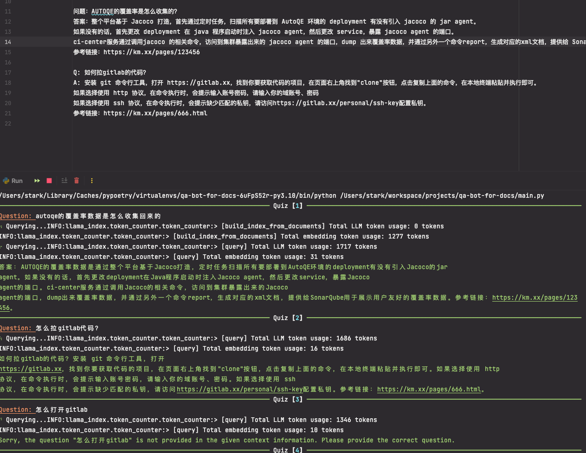

# QA ChatBots For Docs

Using llama_index(AKA GTP_INDEX) to connect docs (local/remote knowledge) to OpenAI GPT models.

## Usage

1. install poetry
2. copy the openai api key
3. execute

```shell
# install dependencies
poetry install
# set open ai api key
export OPENAI_API_KEY="xxxx"
# launch main file
poetry run python main.py

# Optional, if docs update, delete the index.json to reindexing the docs
rm index.json
```

## Snapshot

的